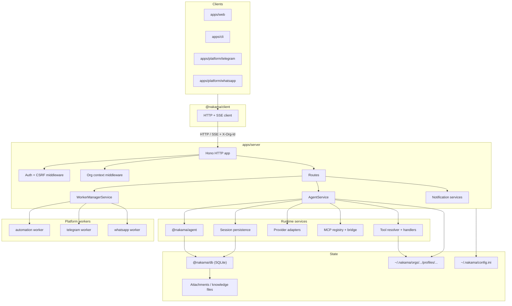

# Nakama Architecture

Agent platform built to work with your team — not replace them. One shared server runtime, thin clients. Orgs are the tenant boundary; profiles, sessions, tools, MCP, skills, automations, tasks, attachments, and usage are org-scoped unless platform-level.

## System overview



**Rule:** `packages/*` ← `apps/*` only (never reverse).

## Repo map

```text
nakama/
├── apps/
│   ├── server/                 # HTTP API, auth, org, agent orchestration
│   ├── web/                    # Dashboard
│   ├── cli/                    # Terminal client
│   └── platform/{automation,telegram,whatsapp,discord}/
├── packages/
│   ├── agent/                  # Prompt assembly, tool loop, chat session
│   ├── core/                   # Contracts, soul, config, builtin tools
│   ├── db/                     # SQLite schema, adapters, migrations
│   └── client/                 # Shared HTTP/SSE client
└── docs/website/
```

## Boundaries

| Layer | Owns |
|---|---|
| Clients (`web`, `cli`, channels) | Thin HTTP/SSE — no agent loop |
| `apps/server` `AgentService` | Composition: profile, provider, tools, MCP, soul, attachments, persistence |
| `packages/agent` | Prompts, tool loop, compaction, `AgentChatSession` |
| `packages/core` | Contracts, soul compose, builtins, channel/attachment helpers, config |
| `packages/db` | Schema + adapters for all persisted entities |

## HTTP

Entrypoint: [`apps/server/src/http/app.ts`](./apps/server/src/http/app.ts)

1. Static web assets (if `webDistDir`)
2. Auth + CSRF
3. Internal automation / notification webhooks (before org middleware)
4. Org middleware (`X-Org-Id` or `active_org_id` → membership + `orgRole`)
5. Routes → services
6. `/openapi.json` from the same Hono registration

Route groups: `auth`, `sessions`, `profiles`, `tools`, `skills`, `mcp`, `automations`, `tasks`, `notification-destinations`, `notification-webhooks`, `workers`, `platform-orgs`, `org-members`, `data-portability`, `system`, `models`, `user-context`.

## Multi-tenancy

Every authed non-platform request needs an active org (`X-Org-Id` or `active_org_id`). Roles: `admin` | `member` | `viewer`. Platform admin: `/v1/platform/*`.

- [`org-middleware.ts`](./apps/server/src/http/org-middleware.ts)
- [`org-guards.ts`](./apps/server/src/http/org-guards.ts)
- [`org-service.ts`](./apps/server/src/services/org-service.ts)

## Agent runtime

Assembled in [`agent-service.ts`](./apps/server/src/services/agent-service.ts): profile + soul, provider/model, builtins, custom JS tools, MCP tools, Super Bot extras, questionnaire/todo, attachments.

Prompt layers:

1. [`soul/compose.ts`](./packages/core/src/soul/compose.ts) — soul content
2. [`chat-prompt.ts`](./packages/agent/src/chat-prompt.ts) — structure + tool instructions
3. [`chat.ts`](./packages/agent/src/chat.ts) — per-turn generation

## Sessions

- Live state: in-memory `AgentChatSession`
- Durable history: SQLite `session_messages` via [`session-persistence.ts`](./apps/server/src/services/session-persistence.ts)
- Questionnaire/todo on `sessions` metadata
- Tables: `sessions`, `session_messages`, `attachments`

## Tools & MCP

| Kind | Where |
|---|---|
| Builtin defs / shared | `packages/core/src/tools/*` |
| Server runtime tools | `apps/server/src/tools/*` |
| Custom JS | `javascript-tool-loader.ts` |
| MCP | `mcp-tool-bridge.ts` |

Tools are profile-scoped (plus Super Bot runtime extras when allowed).

## Workers, automations, tasks

PM2 via [`worker-manager-service.ts`](./apps/server/src/services/worker-manager-service.ts):

- `apps/platform/automation` — scheduled work
- `apps/platform/telegram` / `whatsapp` — channel bridges

Persisted separately: `automations` + `automation_runs`, `tasks` + `task_runs`.

Services: `automation-service.ts`, `automation-runner.ts`, `task-service.ts`, `task-runner.ts`.

## Notifications & attachments

- Destinations + inbound webhooks: `notification-destination-service.ts`, `notification-webhook-service.ts`
- Attachments: SQLite records + on-disk files → rehydrated into provider messages (`attachment-service.ts`)

## CLI terminal UI

| File | Role |
|---|---|
| `terminal-renderer.ts` | Composer / transcript / stream / status semantics |
| `terminal-layout.ts` | Viewport, pinned input, stream buffer, frame diff |
| `virtual-message-list.ts` | Transcript + wrapping / spacing |
| `terminal-frame.ts` | Frame diff + cursor |

Flow: `PersistentPrompt` → `TerminalRenderer.buildComposerLines()` → `TerminalLayout` reserves composer rows → transcript via `beginMessage` / `writelnScroll` / `endMessage` → stream into `streamBuffer`, then `endStream()` seals.

Spacing is layered (do not conflate): user bubble padding, composer padding, inter-message gaps (`shouldInsertLeadingGap`), post-stream gap in `endStream()`.

## Persistence

Schema: [`packages/db/sql/schema.sql`](./packages/db/sql/schema.sql)

| Area | Tables |
|---|---|
| Tenant / auth | `organizations`, `users`, `org_members`, `org_invites`, `browser_sessions` |
| Agent config | `profiles`, `tools`, `profile_tools`, `skills`, `profile_skills`, `mcp_servers`, `profile_mcp_servers` |
| Runtime | `sessions`, `session_messages`, `attachments` |
| Execution | `automations`, `automation_runs`, `tasks`, `task_runs` |
| Notifications | `notification_destinations` |
| Analytics / config | `llm_usage_stats`, `llm_usage_model_stats`, `workspace_settings` |

## Invariants

- `packages/*` must not import `apps/*`
- Org membership checked before org-scoped routes
- Profiles control behavior and tool availability
- Message history is durable (not process-memory only)
- OpenAPI from the same Hono app used at runtime
- Channel apps are transport bridges, not separate agent runtimes
- PM2 is optional but the intended worker orchestration path
