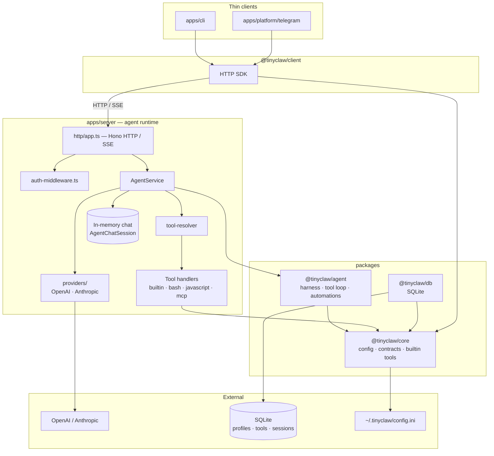

# TinyClaw Architecture

TinyClaw is a personal AI assistant: one agent runtime, multiple thin clients. Users chat with configurable bots, draft automations, and (eventually) run them. Everything funnels through a single HTTP server; clients do not embed agent logic.

## System overview



**Dependency rule:** `packages/*` never import from `apps/*`. Shared code flows packages → apps only.

## Codemap

```text
tinyclaw/
├── apps/
│   ├── cli/                 # Terminal client (primary); auto-starts server
│   ├── platform/
│   │   └── telegram/        # Telegram bot bridge; auto-starts server
│   │   └── whatsapp/        # WhatsApp bot bridge; auto-starts server
│   └── server/              # HTTP API, agent runtime, LLM providers, openapi.json, scripts/
├── packages/
│   ├── core/                # Config, API types, provider interfaces, builtin tools
│   ├── agent/               # Chat harness, tool loop, automation engine
│   ├── db/                  # SQLite via bun:sqlite
│   └── client/              # HTTP SDK for apps
```

**Where is the thing that does X?**

| Question | Look in |
|----------|---------|
| HTTP routing | `apps/server/src/http/app.ts` and `apps/server/src/http/routes/*` |
| HTTP auth / CSRF | `apps/server/src/http/auth-middleware.ts`, `shared.ts`, `public-routes.ts` |
| Session lifecycle, model switching | `AgentService` |
| Profile CRUD, soul files, avatar, knowledge base | `apps/server/src/http/routes/profiles.ts`, `AgentService` |
| Resolving DB-backed tools a session may call | `tool-resolver.ts` |
| MCP server registry, connections, profile assignment | `mcp-service.ts`, `mcp-client-manager.ts` |
| Runtime MCP tool expansion for assigned servers | `mcp-tool-bridge.ts` in `AgentService.resolveProfileTools` |
| Super Bot meta-tools, bash | `super-bot-tools.ts`, `bash.ts` |
| LLM vendor calls | `providers/` in `apps/server` |
| Chat, streaming, tool loop | `AgentHarness`, `AgentChatSession` in `@tinyclaw/agent` |
| SQLite schema (`packages/db/sql/schema.sql`) | `@tinyclaw/db` |
| CLI server discovery / spawn | `ensure-server.ts` in `apps/cli` |
| Shared request/response types | `@tinyclaw/core` (`contract.ts`) |
| OpenAPI generation | `apps/server/src/http/openapi.ts` plus route-owned registration in `apps/server/src/http/routes/*` |

Use symbol search for exact paths — names are stable; line numbers are not.

## Architectural invariants

**One agent runtime.** Chat and automation drafting run only in `apps/server`. No client talks to OpenAI or Anthropic directly.

**Hub and spoke.** New channels are thin apps on `@tinyclaw/client`. There is no second agent implementation per channel.

**Packages do not depend on apps.** `packages/*` must not import from `apps/*`. Shared code flows packages → apps, never the reverse.

**Hono owns the HTTP surface.** The server entrypoint builds a single `OpenAPIHono` app in `apps/server/src/http/app.ts`. Runtime, tests, auth, and OpenAPI all go through that same app.

**Providers are server-only.** OpenAI and Anthropic adapters live under `apps/server/src/providers/`, not in `@tinyclaw/core` or `@tinyclaw/agent`.

**Profiles gate behavior.** A session binds to a profile (`default` when omitted). The profile supplies the system prompt and tool allowlist before any message is handled.

**Chat history is in-memory.** `AgentChatSession` holds `ChatMessage[]` in the server process. SQLite stores profiles, tools, session metadata — not message bodies.

**Tools are allowlisted per profile.** The model may only invoke tools assigned to the active profile. Super Bot gets extra runtime tools (meta-tools, `bash`) injected server-side for `super_bot`.

**Tool calls use native LLM function calling.** Allowed tools are sent to OpenAI or Anthropic as structured definitions with JSON Schema parameters. The model returns tool calls; the server executes handlers and feeds results back as tool messages. Streaming clients receive `tool_start` / `tool_end` SSE events during execution.

## Boundaries

See the [system overview](#system-overview) diagram for the full topology. At a high level:

**Client ↔ server.** `@tinyclaw/client` knows session IDs and API shapes from `@tinyclaw/core`. It has no visibility into providers, profiles beyond the API, or the tool loop.

**HTTP ↔ auth.** Hono middleware enforces bearer auth and browser cookie-session auth. Mutating browser requests must also pass CSRF checks, except for explicitly public routes such as login/setup.

**Server ↔ agent package.** `AgentService` owns the session map and delegates to `AgentHarness`. The harness depends on `Provider` from `@tinyclaw/core`, not on HTTP or SQLite.

**Server ↔ database.** Profiles, tools, profile–tool links, session rows, and automations schema persist in SQLite. Live chat state does not cross this boundary.

**Agent ↔ tools.** The harness asks the model; the server resolves and runs handlers. Builtin tools come from `@tinyclaw/core`; server-specific handlers (bash, Super Bot meta-tools) are registered in `apps/server`.

## Request lifecycle

1. `apps/server/src/http/app.ts` checks static web assets first.
2. Hono auth middleware validates bearer auth or browser session auth, then enforces CSRF for mutating browser requests.
3. A route handler in `apps/server/src/http/routes/*` parses the request and calls the right service.
4. Service code calls `AgentService`, persistence, workers, MCP, automations, or tasks as needed.
5. `/openapi.json` is generated from the same Hono route registration, so docs and runtime stay aligned.

## Cross-cutting concerns

**Configuration** — API key and model live in `~/.tinyclaw/config.ini`, or via `OPENAI_API_KEY` / `ANTHROPIC_API_KEY` (OpenAI preferred when both are set). Provider is inferred automatically. Loaded through `@tinyclaw/core`. The server writes `~/.tinyclaw/runtime/server-url.txt` so clients can find it.

**IDs** — Entities use prefixed IDs via `createId()` (e.g. `session_…`, `profile_…`).

**API versioning** — `TINYCLAW_API_VERSION` is returned by `/health`. The server uses it for singleton detection (don't start a duplicate). Clients should reject incompatible versions.

**OpenAPI** — The HTTP surface is generated from Hono route registration in `apps/server/src/http/routes/*` via `apps/server/src/http/openapi.ts`. Regenerate with `bun run openapi:generate`. Treat route code as source of truth, not `openapi.json`.

**Offline-friendly startup** — The server starts without an API key. Chat and automation drafting degrade to heuristic fallbacks when no provider is configured.
