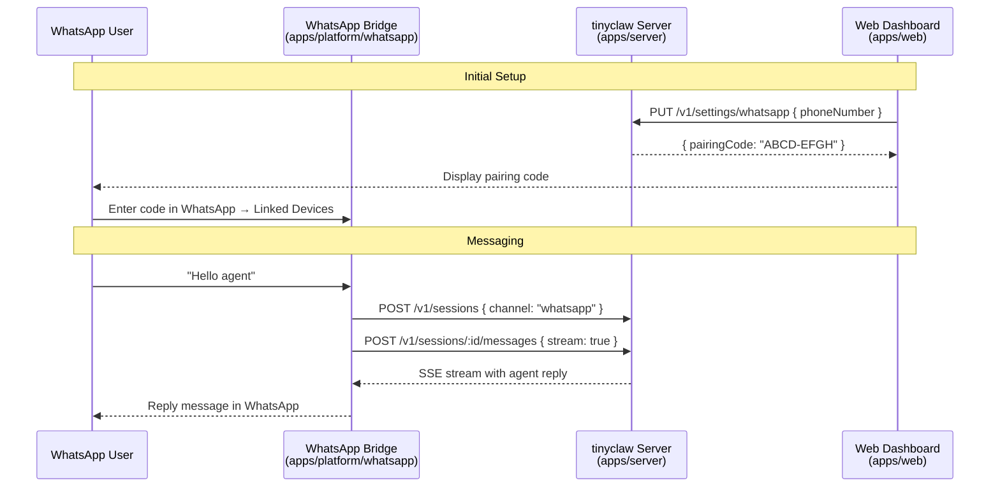

# Add WhatsApp Integration Channel

## Summary

Add a WhatsApp integration channel (`apps/platform/whatsapp`) following the existing Telegram bridge pattern — a thin client using `@tinyclaw/client` to forward messages to the tinyclaw server with `channel: "whatsapp"`. Uses Baileys (open-source WhatsApp Web protocol library) for message transport, pairing-code authentication, and the same hub-and-spoke architecture as Telegram. Includes core package config/types, server API endpoints, client SDK methods, and a web dashboard settings card.

---

## Problem Frame

Users can currently interact with tinyclaw agents only through the CLI or web dashboard. Adding WhatsApp as an alternative interface lets users trigger workflows and receive agent updates on-the-go from their mobile devices, without needing the dashboard open.

---

## Requirements

- R1. Inbound messaging: incoming WhatsApp messages are forwarded to the agent runtime via the server API
- R2. Outbound messaging: agent responses are sent back to the user's WhatsApp chat
- R3. Authentication: users connect their WhatsApp account via pairing code (entered in WhatsApp, not in the chat)
- R4. Session persistence: WhatsApp chat sessions are mapped to server sessions and survive restarts
- R5. Config via environment or INI file, mirroring the Telegram config pattern
- R6. Web dashboard settings page for configuring WhatsApp (phone number, profile, pairing code)
- R7. System status includes WhatsApp worker health (configured, paired, running)
- R8. The WhatsApp bridge auto-starts the server if not running, mirroring the CLI and Telegram behavior
- R9. Commands available in chat: /help, /clear, /compact, /new, /stop, /status
- R10. Typing indicator shown while the agent is generating a response
- R11. Long messages are split to stay within WhatsApp message length limits

---

## Scope Boundaries

- Image/media sending from WhatsApp to the agent is deferred — the initial release handles text only
- Proactive outbound messages (agent-initiated notifications without a user message) are deferred
- Group chat support is out of scope — private/individual chats only
- WhatsApp Business API (Meta Cloud API) is out of scope — Baileys is the chosen provider
- No database migration needed — the `sessions.channel` column stores free-form text and already accepts new values

### Deferred to Follow-Up Work

- WhatsApp image/media handling (inbound photos from user, outbound images from agent) — separate PR
- Proactive agent notifications via WhatsApp — separate PR after session notification infrastructure exists
- Multi-number support (running multiple WhatsApp bridges) — future iteration

---

## Context & Research

### Relevant Code and Patterns

- `apps/platform/telegram/` — the reference implementation; hub-and-spoke thin client pattern
- `packages/core/src/telegram-config.ts` — INI-based config file with handshake/auth logic
- `packages/core/src/telegram-worker.ts` — heartbeat file pattern for worker status
- `packages/core/src/contract.ts` — `AgentChannel` type, settings response types
- `packages/client/src/client.ts` — HTTP SDK methods; `createSession("telegram", ...)` pattern
- `apps/server/src/app.ts` — settings API routes; `parseChannel()` allowlist
- `apps/server/src/services/agent-service.ts` — settings delegation methods; `parseAgentChannel()`
- `apps/server/src/services/system-status-service.ts` — worker status aggregation
- `apps/web/src/components/TelegramSettingsCard.tsx` — React settings component pattern
- `apps/web/src/hooks/use-telegram-settings.ts` — TanStack Query hook pattern

### External References

- Baileys (`@whiskeysockets/baileys`) — WhatsApp Web protocol library, ESM-only v7 RC, MIT license
- Baileys uses WebSocket connections (not HTTP webhook), consistent with the Telegram long-polling model
- Baileys supports pairing-code auth (user enters code in WhatsApp, not in the bot chat) which differs from Telegram's handshake-in-chat model
- Bun compatibility with Baileys is improving (v7 RC maintainers report testing with Bun) but may require a Node.js fallback for the bridge process

---

## Key Technical Decisions

- **Baileys over Meta Cloud API**: The user chose Baileys for self-contained operation (no business account, no public webhook endpoint needed). This mirrors Telegram's polling model and keeps the deployment simple.
- **Pairing-code auth flow (not QR)**: Users provide their phone number in the web dashboard, which generates a pairing code. They enter the code in WhatsApp → Settings → Linked Devices. This is more user-friendly than scanning a QR code in a terminal.
- **Phone number as user identifier**: WhatsApp JIDs (e.g., `1234567890@s.whatsapp.net`) identify users, replacing Telegram's numeric user IDs. The auth model treats the linked phone number as the sole authorized user — there is no multi-user pairing flow like Telegram.
- **Auth state stored on filesystem**: Baileys session credentials (encryption keys, session data) are stored in `~/.tinyclaw/whatsapp/auth/` using `useMultiFileAuthState`. A DB-backed store would be an improvement but is deferred to keep the initial implementation consistent with the file-based Telegram pattern.
- **Single-user auth model**: Unlike Telegram (which supports multiple paired users and allowlisted IDs), the WhatsApp bridge authorizes a single linked phone number. This is a natural fit since Baileys connects as a linked device to one WhatsApp account.
- **Bun-first with Node.js fallback**: The bridge will target Bun as the primary runtime (consistent with the rest of tinyclaw). If Baileys encounters `node:crypto` issues on Bun, the bridge can be run with Node.js as documented in the README, similar to how other Node-specific tools handle runtime compatibility.

---

## Open Questions

### Resolved During Planning

- **Which WhatsApp provider?** — Baileys, per user decision. Keeps the architecture consistent with Telegram's self-contained, no-webhook model.
- **Auth approach?** — Pairing code, not QR. Better UX for a bot that users configure via a web dashboard.

### Deferred to Implementation

- **Exact Bun/Node compatibility handling** — Whether the bridge needs `--experimental-vm-modules` or other Node.js flags will be determined during implementation and testing.
- **Message formatting fidelity** — WhatsApp supports basic formatting (bold, italic, monospace, strikethrough) but not Markdown. The exact formatting conversion strategy will be determined during implementation.

---

## Output Structure

```
apps/platform/whatsapp/
  src/
    index.ts
    socket.ts
    chat-handler.ts
    config.ts
    session-store.ts
    auth-store.ts
    format.ts
    typing-indicator.ts
    active-stream.ts
    chat-handler.test.ts
    format.test.ts
    test-helpers.ts
  package.json
  README.md

packages/core/src/
  whatsapp-config.ts
  whatsapp-worker.ts
```

---

## High-Level Technical Design

> *This illustrates the intended approach and is directional guidance for review, not implementation specification. The implementing agent should treat it as context, not code to reproduce.*



The WhatsApp bridge is structurally parallel to the Telegram bridge: it connects to WhatsApp via Baileys (instead of grammy), forwards messages to the tinyclaw server via `@tinyclaw/client` (same SDK), and maps WhatsApp JIDs to server sessions. The key difference is auth — Baileys uses linked-device pairing codes entered in WhatsApp (not in the bot chat), and the phone number / JID is the sole identifier instead of Telegram's multi-user pairing model.

---

## Implementation Units

### U1. Core Package — WhatsApp Config & Worker Types

**Goal:** Add WhatsApp configuration, settings types, and worker status types to `@tinyclaw/core`, mirroring the Telegram config pattern but adapted for WhatsApp's auth model (phone number + pairing code instead of bot token + handshake).

**Requirements:** R3, R5, R7

**Dependencies:** None

**Files:**
- Create: `packages/core/src/whatsapp-config.ts`
- Create: `packages/core/src/whatsapp-worker.ts`
- Modify: `packages/core/src/contract.ts`
- Modify: `packages/core/src/index.ts`
- Modify: `packages/core/package.json`
- Test: `packages/core/src/whatsapp-config.test.ts`

**Approach:**
- `whatsapp-config.ts`: Define `WhatsAppConfigFile` (phoneNumber, profileId, pairedJid, pairingCode), `WhatsAppSettingsPublic`, and `UpdateWhatsAppSettingsInput` interfaces. Config stored at `~/.tinyclaw/whatsapp/config.ini`. Key difference from Telegram: `phoneNumber` replaces `botToken`; `pairedJid` stores the authorized user's WhatsApp JID after successful pairing; `pairingCode` replaces `handshakeCode` to match WhatsApp-specific terminology. After Baileys reports a successful connection, the pairing code is cleared (mirroring Telegram's handshake-clearing pattern).
- `whatsapp-worker.ts`: Heartbeat file at `~/.tinyclaw/whatsapp/worker-heartbeat.json`, mirroring `telegram-worker.ts` structure.
- `contract.ts`: Add `"whatsapp"` to `AgentChannel` type union. Add `WhatsAppSettingsResponse`, `UpdateWhatsAppSettingsRequest`, and `WhatsAppWorkerStatus` interfaces. Add `whatsappWorker` field to `SystemStatusResponse`.
- `package.json`: Add `"./whatsapp-config"` and `"./whatsapp-worker"` sub-path exports.
- `index.ts`: Re-export from new modules.

**Patterns to follow:**
- `packages/core/src/telegram-config.ts` for config file structure and INI parsing
- `packages/core/src/telegram-worker.ts` for heartbeat and worker status
- `packages/core/src/contract.ts` for type definitions

**Test scenarios:**
- Happy path: `loadWhatsAppConfigFile()` reads and parses a valid config.ini with phoneNumber and profileId
- Edge case: `loadWhatsAppConfigFile()` returns null when file does not exist
- Happy path: `isWhatsAppUserAuthorized()` returns true when JID matches pairedJid
- Happy path: `isWhatsAppUserAuthorized()` returns false when JID does not match pairedJid (single-user auth)
- Happy path: `generateWhatsAppPairingCode()` produces an 8-character hex code (mirroring `generateHandshakeCode()`)
- Happy path: `saveWhatsAppConfig()` generates a pairing code when phone number is first saved without one
- Edge case: `isWhatsAppUserAuthorized()` returns false when JID does not match pairedJid
- Happy path: `resolveWhatsAppConfigFromSources()` merges env vars with file config
- Happy path: `writeWhatsAppWorkerHeartbeat()` and `readWhatsAppWorkerHeartbeat()` round-trip correctly
- Edge case: `isHeartbeatAlive()` returns false for stale heartbeats

**Verification:**
- All config tests pass
- Worker heartbeat read/write round-trips correctly
- TypeScript type checks pass with `"whatsapp"` in `AgentChannel`

---

### U2. Server — WhatsApp Settings API & Channel Support

**Goal:** Add WhatsApp settings endpoints to the server, extend channel parsing to accept `"whatsapp"`, and add WhatsApp worker status to the system status response.

**Requirements:** R6, R7

**Dependencies:** U1

**Files:**
- Modify: `apps/server/src/app.ts`
- Modify: `apps/server/src/services/agent-service.ts`
- Modify: `apps/server/src/services/system-status-service.ts`
- Modify: `apps/server/src/openapi/build-spec.ts`
- Modify: `apps/server/src/openapi/schemas.ts`

**Approach:**
- `app.ts`: Add three routes mirroring Telegram pattern — `GET /v1/settings/whatsapp`, `PUT /v1/settings/whatsapp`, `POST /v1/settings/whatsapp/pairing-code`. Add `"whatsapp"` to `parseChannel()` allowlist.
- `agent-service.ts`: Add `"whatsapp"` to `parseAgentChannel()`. Add `getWhatsAppSettings()`, `setWhatsAppSettings()`, `regenerateWhatsAppPairingCode()` methods delegating to `@tinyclaw/core/whatsapp-config`.
- `system-status-service.ts`: Import and call `getWhatsAppWorkerStatus()`, add `whatsappWorker` field to response.
- `openapi/build-spec.ts` and `schemas.ts`: Add WhatsApp settings schemas and routes.

**Patterns to follow:**
- Telegram settings routes in `app.ts` (GET, PUT, POST handshake/pairing-code pattern)
- `agent-service.ts` settings methods (delegating to core package)
- `system-status-service.ts` for worker status aggregation

**Test scenarios:**
- Happy path: `GET /v1/settings/whatsapp` returns default settings when not configured
- Happy path: `PUT /v1/settings/whatsapp` saves phone number and profile
- Happy path: `POST /v1/settings/whatsapp/pairing-code` generates a new pairing code
- Happy path: System status response includes `whatsappWorker` field
- Edge case: `parseChannel("whatsapp")` returns `"whatsapp"` without error
- Error path: `PUT /v1/settings/whatsapp` without phone number on first save returns 400

**Verification:**
- WhatsApp settings API endpoints respond correctly
- System status includes WhatsApp worker status
- `parseChannel("whatsapp")` is accepted

---

### U3. Client Package — WhatsApp Settings Methods

**Goal:** Add WhatsApp settings methods to `TinyClawClient` so the web dashboard and bridge can manage WhatsApp configuration.

**Requirements:** R6

**Dependencies:** U1

**Files:**
- Modify: `packages/client/src/client.ts`
- Modify: `packages/client/src/types.ts`

**Approach:**
- Add `getWhatsAppSettings()`, `setWhatsAppSettings()`, `regenerateWhatsAppPairingCode()` methods to `TinyClawClient`, mirroring the Telegram settings methods.
- Import `WhatsAppSettingsResponse`, `UpdateWhatsAppSettingsRequest` from `@tinyclaw/core/contract`.

**Patterns to follow:**
- Telegram settings methods in `client.ts` (lines ~776-793)

**Test scenarios:**
- Happy path: `getWhatsAppSettings()` calls `GET /v1/settings/whatsapp` and returns typed response
- Happy path: `setWhatsAppSettings()` calls `PUT /v1/settings/whatsapp` with request body
- Happy path: `regenerateWhatsAppPairingCode()` calls `POST /v1/settings/whatsapp/pairing-code`

**Verification:**
- Client methods are callable and type-check correctly
- Existing tests continue to pass

---

### U4. WhatsApp Bridge Application

**Goal:** Create the WhatsApp bridge app at `apps/platform/whatsapp` that connects to WhatsApp via Baileys, handles incoming messages with auth/session/commands, and streams agent replies back.

**Requirements:** R1, R2, R3, R4, R5, R8, R9, R10, R11

**Dependencies:** U1, U2, U3

**Files:**
- Create: `apps/platform/whatsapp/src/index.ts`
- Create: `apps/platform/whatsapp/src/socket.ts`
- Create: `apps/platform/whatsapp/src/chat-handler.ts`
- Create: `apps/platform/whatsapp/src/config.ts`
- Create: `apps/platform/whatsapp/src/session-store.ts`
- Create: `apps/platform/whatsapp/src/auth-store.ts`
- Create: `apps/platform/whatsapp/src/format.ts`
- Create: `apps/platform/whatsapp/src/typing-indicator.ts`
- Create: `apps/platform/whatsapp/src/active-stream.ts`
- Create: `apps/platform/whatsapp/src/chat-handler.test.ts`
- Create: `apps/platform/whatsapp/src/format.test.ts`
- Create: `apps/platform/whatsapp/src/test-helpers.ts`
- Create: `apps/platform/whatsapp/package.json`
- Create: `apps/platform/whatsapp/README.md`
- Modify: `package.json` (root — add `dev:whatsapp` script)

**Approach:**
- `socket.ts`: Baileys connection lifecycle management — `makeWASocket`, connection.update handler (with reconnection), creds.update handler, message event listener. Manages pairing code generation and session persistence using `useMultiFileAuthState`. Handles the different phases: not connected (generate pairing code), connecting, connected, disconnected (reconnect unless logged out).
- `chat-handler.ts`: Core message routing. Checks auth (is JID authorized?), handles commands (/help, /clear, /compact, /new, /stop, /status), resolves or creates sessions, streams agent replies. Uses per-chat locking like the Telegram bridge.
- `config.ts`: Loads config from `@tinyclaw/core/whatsapp-config` and env vars (`WHATSAPP_PHONE_NUMBER`, `TINYCLAW_WHATSAPP_PROFILE_ID`, `TINYCLAW_SERVER_URL`).
- `session-store.ts`: Maps WhatsApp JID to `{sessionId, profileId, updatedAt}`, persisted to `~/.tinyclaw/whatsapp/chat-sessions.json`.
- `auth-store.ts`: Wraps `@tinyclaw/core/whatsapp-config` for authorization checks (is this JID authorized?).
- `format.ts`: Message formatting — strip markdown-to-WhatsApp conversion, split long messages (WhatsApp limit ~65536 chars). WhatsApp supports `*bold*`, `_italic_`, `~strikethrough~`, `` `monospace` ``.
- `typing-indicator.ts`: Periodic `sendPresenceUpdate('composing', jid)` during streaming (like Telegram's chat action loop).
- `active-stream.ts`: AbortController per JID for /stop support.
- `index.ts`: Entry point — ensure server running, create client, load config, create socket, start bridge, write heartbeat.

**Patterns to follow:**
- `apps/platform/telegram/src/` for overall structure, session-store, auth-store, active-stream, and entry point
- `apps/platform/telegram/src/chat-handler.ts` for message routing, command handling, stream handling
- `apps/platform/telegram/src/format.ts` for message splitting

**Execution note:** Start with a failing integration test for the pairing flow and command handling, then implement the bridge.

**Test scenarios:**
- Happy path: Authorized JID can send a message and receive a streamed reply
- Happy path: `/help`, `/clear`, `/compact`, `/new`, `/status` commands work for authorized users
- Happy path: `/stop` aborts an in-flight stream and sends partial reply
- Edge case: Unauthorized JID is blocked from chatting
- Edge case: Unknown commands return help text
- Error path: Server connection failure returns an error message
- Edge case: Very long agent replies are split into multiple WhatsApp messages
- Happy path: Typing indicator is sent periodically during streaming
- Happy path: Session store persists JID-to-sessionId mapping across restarts
- Integration: Chat lock prevents concurrent messages from the same JID

**Verification:**
- Bridge starts, connects to WhatsApp via Baileys, handles incoming messages
- Commands route correctly
- Auth flow (pairing code generation, JID authorization) works
- Streaming replies are sent back to WhatsApp

---

### U5. Web Dashboard — WhatsApp Settings Card

**Goal:** Add a WhatsApp settings card to the web dashboard's Settings page, allowing users to configure their phone number, see pairing codes, and check connection status.

**Requirements:** R6

**Dependencies:** U2, U3

**Files:**
- Create: `apps/web/src/components/WhatsAppSettingsCard.tsx`
- Create: `apps/web/src/hooks/use-whatsapp-settings.ts`
- Modify: `apps/web/src/lib/query-keys.ts`
- Modify: `apps/web/src/pages/SettingsPage.tsx`

**Approach:**
- `WhatsAppSettingsCard.tsx`: React component showing phone number input (with masked display), profile selector, pairing code display with copy button, connection status badge (Not configured / Awaiting pair / Connected), and a "Generate Pairing Code" button. Mirrors `TelegramSettingsCard.tsx` structure but adapts the auth UX for WhatsApp (phone number instead of bot token, pairing code generated from dashboard instead of pasted in chat).
- `use-whatsapp-settings.ts`: TanStack Query hooks for `getWhatsAppSettings`, `setWhatsAppSettings`, `regenerateWhatsAppPairingCode`, mirroring the Telegram hooks.
- Add `whatsapp: { settings: ["whatsapp", "settings"] }` to `query-keys.ts`.
- Render `<WhatsAppSettingsCard />` in `SettingsPage.tsx`.

**Patterns to follow:**
- `apps/web/src/components/TelegramSettingsCard.tsx` for UI structure and hook usage
- `apps/web/src/hooks/use-telegram-settings.ts` for TanStack Query hook pattern

**Test scenarios:**
- Happy path: Card renders "Not configured" status when no phone number is set
- Happy path: Saving phone number and profile updates settings and shows pairing code
- Happy path: "Generate Pairing Code" button calls regenerate and displays new code
- Happy path: Status badge shows "Connected" when bridge is running and paired

**Verification:**
- WhatsApp settings card renders in the Settings page
- Phone number, profile, and pairing code can be configured
- Connection status reflects the bridge's state

---

## System-Wide Impact

- **Interaction graph:** New `channel: "whatsapp"` value flows through session creation, message sending, and session listing. The `parseChannel()` and `parseAgentChannel()` functions in the server expand their allowlists.
- **Error propagation:** WhatsApp bridge follows the same pattern as Telegram — agent errors are formatted and sent as user-facing messages; bridge-level errors (connection failures, auth errors) are logged and surfaced in system status.
- **State lifecycle:** Baileys auth state is stored on the filesystem (`~/.tinyclaw/whatsapp/auth/`). If the auth directory is deleted, the bridge must re-pair. Session mapping is in `~/.tinyclaw/whatsapp/chat-sessions.json`, consistent with Telegram's approach.
- **API surface parity:** New endpoints `GET/PUT /v1/settings/whatsapp` and `POST /v1/settings/whatsapp/pairing-code` follow the Telegram settings pattern exactly. The `SystemStatusResponse` type gains a `whatsappWorker` field.
- **Integration coverage:** The bridge is the primary integration point — it connects Baileys events to server API calls via `@tinyclaw/client`. Unit tests on the chat handler and config module cover the main paths.
- **Unchanged invariants:** The server's agent runtime, LLM providers, profile system, and tool resolution are all untouched. The WhatsApp bridge is a pure consumer of the same HTTP API the CLI and Telegram bridge use.

---

## Risks & Dependencies

| Risk | Mitigation |
|------|------------|
| Baileys Bun compatibility — `node:crypto` issues may block runtime | Start with Bun; if issues arise, document Node.js fallback in README (`node --experimental-vm-modules apps/platform/whatsapp/src/index.ts`). The bridge is a separate process and does not need to share the Bun runtime with the server. |
| Baileys v7 is in RC — API may change before stable | Pin the Baileys version in package.json. Monitor the Baileys changelog. The stable v6 branch is available as a fallback. |
| WhatsApp may restrict or ban accounts sending automated messages | Implement message rate limiting in the bridge. Use realistic browser identifiers (`Browsers.ubuntu('TinyClaw')`). Document anti-ban practices in README. |
| Auth state on filesystem is fragile — if `~/.tinyclaw/whatsapp/auth/` is deleted, user must re-pair | Document this behavior. The same fragility exists for Telegram's `config.ini` and session mapping. Consistent with existing patterns. |
| Pairing code flow is different from Telegram's — may confuse existing users | Clear UI guidance in the settings card (step-by-step: "1. Enter phone number, 2. Click Generate Pairing Code, 3. Open WhatsApp → Settings → Linked Devices → Link with phone number, 4. Enter the code"). |

---

## Documentation / Operational Notes

- Add `bun run dev:whatsapp` script to root `package.json`
- Add WhatsApp section to `FEATURES.md` (commands, setup steps, config)
- Add WhatsApp section to `ARCHITECTURE.md` (system overview diagram, codemap)
- Add WhatsApp environment variables to `DEVELOPMENT.md` (`WHATSAPP_PHONE_NUMBER`, `TINYCLAW_WHATSAPP_PROFILE_ID`, `TINYCLAW_SERVER_URL`)
- WhatsApp bridge README at `apps/platform/whatsapp/README.md`
- Docker configuration note: Baileys auth directory needs to be on a persistent volume

---

## Sources & References

- Related code: `apps/platform/telegram/` (reference implementation)
- Related code: `packages/core/src/telegram-config.ts` (config pattern)
- Related code: `packages/core/src/telegram-worker.ts` (worker status pattern)
- External docs: [Baileys documentation](https://whiskey-so.github.io/Baileys/)
- External docs: [WhatsApp Business Platform](https://developers.facebook.com/docs/whatsapp) (not used, but context for alternative approaches)